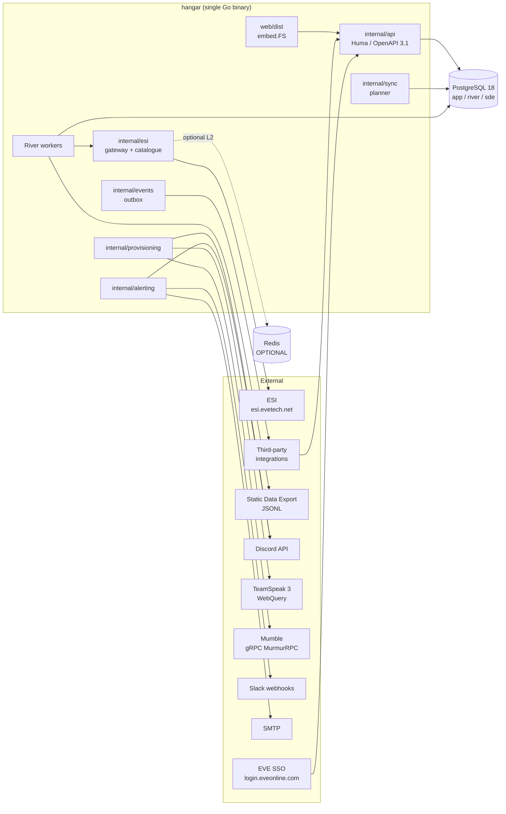
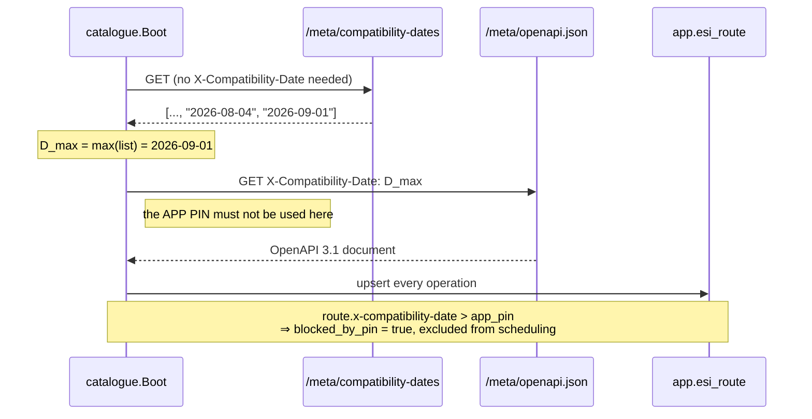

# 01 — Tech Stack & Architectural Blueprint

**Project:** HANGAR
**Derived from:** [`00_SRS_v3.1.md`](00_SRS_v3.1.md) (v3.1, approved — supersedes v3.0)
**Compatibility date pin:** `2026-08-04`
**Status:** Architecture baseline for Phases 0–20
**Audience:** the implementing agent (Sonnet 5, medium effort) and future maintainers

---

## 0. How to read this document

This is the *binding* architectural interpretation of the SRS. Where the SRS states a
requirement, this document states the mechanism that satisfies it and names the
package that owns it. Where the SRS was silent or under-specified, this document
records a **[DECISION]** with its rationale.

**Revision note.** The first pass of this document raised seven defects (F-1…F-7) in
SRS v3.0. All seven have been corrected in **SRS v3.1** and are now *decided design*
rather than open questions. §18 records each defect, the correction, and where the
mechanism now lives — kept because the rationale is worth preserving, not because
anything remains undecided.

The three structural corrections that most change the implementation:

| Was | Now | Section |
| :-- | :-- | :-- |
| Governor 1 ledger state per-replica, unshared | **Cluster-shared through Postgres**, with an automatically selected in-process fast path when exactly one replica is live | §5.5–§5.7 |
| "~48 core tables" | **51 platform + ≈78 domain = ≈129**, Phase 1 split into 1a/1b | `02_…` §2 |
| "No custom `.css` files" | **Exactly one** sanctioned stylesheet, CI-enforced | §15.3 |

---

## 1. System context



**Trust boundaries.** Refresh tokens cross exactly one boundary: `app.character_token`
(ciphertext at rest) → `internal/crypto` (plaintext in memory) → `internal/esi/transport`
(Authorization header). No other package may hold plaintext, and no plaintext may reach
a log, a span attribute, an error string, or an API response (Principle 8).

---

## 2. Process model and deployment topology

One binary, one Cobra command tree, five roles:

| Command | Runs | Notes |
| :-- | :-- | :-- |
| `hangar serve` | HTTP API + embedded SPA + in-process River workers + planner | Default. Single-process installation. |
| `hangar work` | River workers only | Horizontal scale-out for sync throughput. |
| `hangar schedule` | Planner loop only | Leader-elected; safe to run several. |
| `hangar migrate up\|down` | River migrator → Goose | Ordered; see §3.3. |
| `hangar admin …` | Bootstrap tokens, pin advance, identifier-type verification, SDE import | Operational surface. |

`hangar healthcheck` is a sixth, trivial command used only by the container healthcheck.

**Leader election.** The planner takes `pg_try_advisory_lock(hashtext('hangar.planner'))`
on a dedicated connection. Losing the connection releases the lock, so failover is
automatic. The planner claims due work every 5 s and enqueues transactionally.

**[DECISION] Single-process default.** Gate 5 forbids operational ceremony. `serve` does
everything; `work`/`schedule` exist for administrators who have outgrown one box.

**Replica registry.** Every process — `serve`, `work`, `schedule` — heartbeats into
`app.esi_replica` every 10 s with its instance id, role and version. A replica is *live*
if its heartbeat is under 30 s old. This registry is what selects the ESI ledger's
execution mode (§5.6): scaling out is detected, never configured. Adding a replica
requires no operator action to stay within ESI's limits.

---

## 3. Package layout

`internal/` is exactly the SRS §3.2 set plus three additions, each justified below.

```
cmd/hangar/                  Cobra entrypoint: serve, work, schedule, migrate, admin, openapi, healthcheck
internal/
  config/                    Viper load + validate + secret binding; fails fast on missing REQUIRED keys
  esi/                       Gateway facade
    catalogue/               OpenAPI ingest, D_max resolution, pin gating, blocked_by_pin
      embedded/              Offline boot snapshot + the D_max it was captured at
    transport/               http.RoundTripper chain: auth, UA, compat-date, retry, instrumentation
    cache/                   L1 ristretto + L2 Postgres UNLOGGED; conditional request assembly
    ratelimit/               Floating-window consumption ledger + error-limit governor
    breaker/                 Per-route + per-entity circuit breakers
    pagination/              Cursor and page-based drivers, torn-set detection
  sso/                       OAuth2 PKCE, token lifecycle, refresh rotation lock
    jwks/                    Cached JWKS, offline verification, unknown-kid refetch throttle
  scopes/                    Opaque scope catalogue, requirement enforcement, reauth workflow
  crypto/                    AES-256-GCM envelope encryption, key versioning, AAD binding
  sync/                      Subscription model, due-time computation, cache-mode policy
    planner/                 Leader-elected claim loop; transactional River enqueue
    normalize/               Per-route response normalisers (request-envelope only; never paths)
  domain/                    Entities, invariants, domain events. No I/O. No SQL. No HTTP.
  store/                     Repository facades
    gen/                     sqlc output — generated, committed, diffed in CI
  rbac/                      Grant model, effective-permission resolution, deny precedence
  alerting/                  Catalogue, interpretation, routing, coalescing, dead-letter
    catalogue/               54 seeded types across 8 domains + threshold-source assertions
    channels/                SMTP, Slack, Discord webhook drivers
    render/                  Typed renderers + the generic key/value fallback
  provisioning/              Entitlement engine, reconciliation loop, revocation SLO
    entitlement/             Pure evaluation of the seven grant sources
    drivers/discord|teamspeak|mumble/
  events/                    Transactional outbox, HMAC-SHA256 signer, webhook dispatch
  api/                       Huma router and handlers
    v1/                      Handlers grouped by §6 subsection
    dto/                     Wire types. Money is `string`. Cursors are opaque.
    filters/                 Whitelisted filter specifications; adversarial-query rejection
    middleware/              Session, RBAC, Strict Mode, audit, request-id, rate limit
    v2shim/                  §10 sunset shim: legacy shapes over v1 handlers
  i18n/                      Locale registry + ESI Accept-Language resolution (single source of truth)
  sde/                       [ADDITION] JSONL streaming import, atomic schema swap
  telemetry/                 [ADDITION] slog redaction handler, OTel wiring, Prometheus registry
db/
  migrations/                Goose, plain SQL, versioned, forward-only in production
  queries/                   sqlc sources
  seed/                      Alert catalogue, permission set, locale table (data, not DDL)
web/                         React 19 SPA (see §15)
docs/                        This blueprint set + generated openapi.json + spec snapshots
deploy/                      install.sh / install.bat / helm
testdata/                    Recorded ESI responses, notification YAML corpus, legacy v2 responses
```

**Additions to the v3.0 package list.** `internal/sde/` and `internal/telemetry/` were
raised as gaps in v3.0 and are now named in **SRS v3.1 §3.2**. SDE streaming is required by
Phase 9 and putting it in `internal/sync/` would couple a one-shot bulk import to the
per-route scheduler; the slog redaction handler is a Phase 0 exit criterion imported by
every package and cannot live inside `config`.

The `internal/esi/*` sub-packages remain a local elaboration: §3.2 describes `internal/esi/`
as one package holding five distinct concerns, but Phase 4 explicitly names
`internal/esi/ratelimit/`, so the split is already implied.

**Dependency rule.** `domain` imports nothing from HANGAR. `store` imports `domain`.
`esi`, `sso`, `crypto`, `i18n`, `telemetry` import `domain` only. `sync`, `rbac`,
`alerting`, `provisioning`, `events`, `scopes` import `domain` + `store` + gateways.
`api` imports everything. Nothing imports `api`. Enforce with an import-boundary lint in
`make lint` from Phase 0 — retrofitting it later is significantly harder.

### 3.3 Migration ordering

`hangar migrate up` runs, in order:

1. River's Go migrator into the `river` schema (River owns its own DDL; never hand-write it).
2. Goose into `app`, then `sde`.
3. Seed idempotently: `app.permission` (closed Go set), `app.alert_type` (54 rows),
   `app.role` defaults.

Goose migrations must never reference `river.*`. If a future feature needs to join
application data against job state, project the needed fields into `app.sync_run` instead.

---

## 4. Configuration and secrets

Viper with precedence flag > env > file > default. `internal/config` validates at boot and
**fails fast**: a missing `HANGAR_MASTER_KEY` or `HANGAR_SESSION_SECRET` must abort
startup with a named error, never fall back to a generated ephemeral key.

Secrets are typed. `config.Secret` is a `string` wrapper whose `String()`, `MarshalJSON`,
`LogValue()` and `Format()` all return `"[REDACTED]"`. Phase 0's recursive redaction test
walks a nested struct containing `Secret` fields at depth ≥ 3 inside maps and slices and
asserts no plaintext survives serialisation.

---

## 5. ESI Gateway (`internal/esi`)

### 5.1 Boot sequence — two dates, never conflated

Principle 12 is the single most misimplementable requirement in the SRS. The mechanism:



| Date | Symbol | Source | Used for | Advanced by |
| :-- | :-- | :-- | :-- | :-- |
| App pin | `P` | `app.setting['esi.compatibility_date']`, seeded `2026-08-04` | **Every data request** | Administrator only, via `POST /api/v1/admin/esi/catalogue/pin`, which **rejects any candidate newer than `D_max`** and records the computed route diff. The administrator must first review that diff via the non-mutating `POST /api/v1/admin/esi/catalogue/pin/preview` (Principle 12; SRS §0 B13, delivered in Phase 18) |
| Discovery | `D_max` | newest entry from `/meta/compatibility-dates` | **Only** the `openapi.json` fetch | Automatically, every boot |

An absent `X-Compatibility-Date` resolves upstream to the *oldest* date, which is never
correct — so the transport chain injects it unconditionally, and a request built without
one is a panic in development and a hard error in production.

**Date arithmetic.** The API rolls at 11:00 UTC. All "which date is current" comparisons
use `now().UTC().Add(-11 * time.Hour).Truncate(24h)`. Future dates are rejected upstream,
so `D_max` is clamped to that value. This is one function, `i18nfree` and table-tested;
do not inline the arithmetic at call sites.

**Offline boot.** If step 1 or 2 fails, load `internal/esi/catalogue/embedded/`. The
snapshot records the `D_max` at which it was captured; the catalogue marks itself
`stale_snapshot` and the admin Route Catalogue surfaces that state. A stale snapshot must
never silently masquerade as a live ingest.

### 5.2 Route catalogue

Every operation becomes one `app.esi_route` row carrying `x-cache-age`, `x-cache-mode`,
`x-rate-limit` (`group`, `max-tokens`, `window-size`), `x-required-roles`, `x-pagination`,
`x-compatibility-date`, the operation's declared scopes, and `upstream_path` **verbatim**.

Ingest is idempotent and additive. A route that disappears from the spec is marked
`retired_at`, never deleted — retiring a route must not orphan the historical
`sync_subscription` rows that reference it (Principle: destructive DML is banned).

Ingest uses `libopenapi` because the spec is OpenAPI **3.1**; `kin-openapi` targets 3.0
and mishandles 3.1's `type: [x, "null"]` union form, which appears in ESI schemas.

### 5.3 Path handling and cache-key normalisation

`upstream_path` is the *sole* authority for request construction. Paths are never derived
from HANGAR's own resource names. The known irregularities that break naive pluralisation:

* `/corporation/{corporation_id}/mining/extractions` — **singular** `corporation`
* `/corporation/{corporation_id}/mining/observers`
* `/corporation/{corporation_id}/mining/observers/{observer_id}`

These are the Phase 2 fixtures. Note that HANGAR's *own* API exposes these as
`/api/v1/corporations/{id}/mining/…` (plural) — the mapping between HANGAR's route and the
upstream route lives in the subscription row, not in a string transformation.

Normalisation operates on the request **envelope only**: trailing-slash removal,
scheme/host lowercasing, query-parameter sorting, percent-encoding canonicalisation. It
must never touch a path segment. The cache key is:

```
sha256( method ‖ normalized_path ‖ sorted_query ‖ compatibility_date ‖ tenant ‖ resolved_esi_language ‖ token_subject )
```

`resolved_esi_language` — never the UI locale (§14). `token_subject` is the JWT `sub`
(`CHARACTER:EVE:<id>`), or the literal `anonymous` on unauthenticated routes.

### 5.4 Conditional caching

Two tiers. **L1** is ristretto, in-process, cost-weighted by serialised body size.
**L2** is an `UNLOGGED` Postgres table — unlogged because a cache loss after a crash is a
revalidation, not a correctness problem, and skipping WAL for it is a large write saving.

`If-None-Match` (ETag) and `If-Modified-Since` (Last-Modified) are sent whenever a
validator is held. 304 is the expected steady state and must be recorded as a *success*
that resets adaptive backoff bookkeeping only on 200 (see §6.2).

`x-cache-mode: no-cache` routes: no L1 write, no L2 write, **and no conditional headers
sent**. The Phase 3 test asserts all three, not just the first.

**[DECISION] Redis as L2.** When `HANGAR_REDIS_URL` is set, Redis replaces the Postgres L2
table. It never becomes authoritative: a Redis error is logged and treated as a miss.
Principle 7 means every test suite runs with Redis absent by default.

### 5.5 Rate limiting — the floating-window consumption ledger

This is the design that Gate 1 and the Phase 4 fidelity test exist to police. Read this
section completely before writing `internal/esi/ratelimit/`.

**The model.** ESI does not refill continuously. The cost of an individual request is
returned to the bucket exactly one `window_size` after *that request*. A continuous-refill
token bucket over-reports headroom immediately after a burst and is **prohibited**.

**State.** One bucket per `(group, userID)`:

| Field | Type | Notes |
| :-- | :-- | :-- |
| `max_tokens` | int | from `x-rate-limit`, reconciled from `X-Ratelimit-Limit` |
| `window` | duration | parsed from the `<max>/<window>` suffix: `m` = minutes, `h` = hours |
| `ledger` | bounded min-heap of `(cost uint8, consumedAt int64)` | ordered by `consumedAt`; evicted on read |
| `reserved` | slice of `(cost=5, deadline)` | in-flight predictive reservations |

`userID` = `applicationID:characterID` on authenticated routes; `sourceIP` or
`sourceIP:applicationID` on unauthenticated routes.

**Available tokens** = `max_tokens − Σ cost(live ledger entries) − Σ cost(live reservations)`,
where *live* means `consumedAt > now − window`. Eviction happens lazily on every read.

**Cost table.** Rows are evaluated top-down; the 429 row takes precedence over the 4XX row.

| Response | Cost |
| :-- | :-- |
| **429** | **0** — never charged. This overrides the 4XX row below. |
| 2XX | 2 |
| 3XX | 1 |
| 4XX (other than 429) | 5 |
| 5XX | 0 |
| transport error, timeout, no response | 5 — the server may have processed it |

**Acquire → settle protocol.**

1. `Acquire(group, userID)` evicts expired entries, then reserves the **worst case (5)**.
   Reserving the optimistic cost allows a run of 4XX responses to overdraw the window —
   this is exactly what the Phase 4 predictive-reservation test proves.
2. If `available < 5`, compute `retryAt = oldestLiveEntry.consumedAt + window` and return
   it. The caller snoozes the subscription; it does **not** spin.
3. On response, `Settle(handle, status, responseTime)` drops the reservation and pushes a
   ledger entry with the observed cost.

**[DECISION] `consumedAt` is the response timestamp, not the request timestamp.** The
server keys its window on when *it* processed the request, which is at or after our issue
time. Using the response timestamp releases the cost strictly no earlier than the server
does, so any error is in the safe direction. Reservations are stamped at issue time and
expire at `HANGAR_ESI_REQUEST_TIMEOUT`, so a lost response cannot leak headroom forever.

**Reconciliation — the server always wins.** Every response carrying `X-Ratelimit-Remaining`
is reconciled:

* `serverRemaining < localAvailable` → push a synthetic entry of cost
  `localAvailable − serverRemaining` at `consumedAt = now`. Pessimistic by construction:
  it expires a full window from now.
* `serverRemaining > localAvailable` → pop the oldest entries until they agree, never
  exceeding `max_tokens`.

Gate 1's "zero divergence beyond one-request tolerance" is this reconciler's acceptance test.

**Headerless 429s.** CCP's in-monolith limiters emit 429 without `X-Ratelimit-*`. The
reconciler must not treat missing headers as `remaining = 0` (that stalls the installation)
nor ignore the 429. Behaviour: charge nothing, honour `Retry-After` if present, otherwise
snooze the subscription for `HANGAR_ESI_TTL_FLOOR`, and increment
`esi_429_headerless_total{group}`. Siblings are unaffected — Principle 3.

**Data structure choice (in-process path).** A min-heap over a pre-allocated slice sized
`max_tokens + 8`. It must be a heap and not a plain deque: responses settle out of order (a
slow request issued first can complete after a fast one issued second), so append order is
not `consumedAt` order. `n ≤ max_tokens ≈ 100`, so push/pop is tens of nanoseconds and the
1M-operation benchmark (< 2 s ⇒ 2 µs/op budget) has three orders of magnitude of headroom.
Buckets are sharded by FNV-1a over the bucket key into `NumCPU()*4` shards, each with its
own mutex, and the backing slices are preallocated so steady state allocates nothing.

### 5.6 The ledger is cluster-shared *(SRS v3.1 §4.1.3, Principle 16)*

ESI enforces the `(group, userID)` budget across the **whole installation**. HANGAR must
therefore account for it across the whole installation. v3.0 made ledger state per-replica
and relied on header reconciliation to correct drift; that does not work, because
reconciliation is *reactive*. Each replica converges on the truth only after it has already
spent, so N replicas each holding what they believe is the full `max_tokens` will spend N×
the budget on a synchronised burst before any correction lands.

**Two execution modes, selected automatically — never configured.**

| Mode | Selected when | Behaviour |
| :-- | :-- | :-- |
| `solo` | the replica registry shows exactly **one** live replica | pure in-process ledger; zero database round-trips per request |
| `clustered` | **two or more** live replicas | shared Postgres ledger with an in-process read-through mirror |

An operator-set divisor or mode flag was the obvious mitigation and is deliberately
**rejected**: a knob that can be set wrongly reintroduces exactly the defect this design
removes, and it would be set wrongly the first time someone scales out at 03:00.

**Shared-mode mechanism.** `app.esi_ledger_bucket` holds one row per `(group, user_key)`
with its `max_tokens`, `window` and reconciliation state; `app.esi_ledger_entry` holds the
`(cost, consumed_at)` entries. Both are UNLOGGED — losing them on crash costs a conservative
re-reconciliation from the next response's headers, not a correctness failure.

Acquire is one short transaction:

1. `SELECT … FROM app.esi_ledger_bucket WHERE (group, user_key) = … FOR UPDATE` — locks that
   bucket and nothing else.
2. Delete entries older than `now() − window`; sum the survivors.
3. If `max_tokens − used ≥ 5`, insert the reservation and commit. Otherwise commit and
   return `retryAt = oldest_live.consumed_at + window`.

Settle updates the reservation's cost and `consumed_at`, or deletes it when the cost is
zero. Reconciliation against `X-Ratelimit-Remaining` happens in the same transaction.

**Contention is negligible.** On authenticated routes `user_key` is
`applicationID:characterID`, so each bucket is one character — different characters never
contend. Unauthenticated routes share a `sourceIP` bucket, but their volume is low.

**Cost.** One row-locked transaction (~0.3 ms locally) against a network call that already
costs 50–500 ms. That is noise, and it buys correctness that header reconciliation cannot.

**Mode transitions must be proven safe.** `solo` → `clustered` flushes the in-process ledger
into the shared table *before* admitting any further request. `clustered` → `solo` reads the
shared table into memory before engaging the fast path. Phase 4's cluster test exercises both
directions and asserts no entry is lost and none is double-counted.

**Gate 1 is run at N=1 and N=3.** The mode selection means a correct implementation passes
both, but the gate must still demonstrate it — a pass at one replica count is evidence about
that count only, and the evidence artefact records which.

### 5.7 Governor 2 — the error limit

100 non-2XX/3XX responses per fixed 60-second window, **installation-wide**. Exceeding it
returns 420 on every route, including routes under Governor 1.

Same reasoning, same conclusion: the budget is cluster-shared through a single Postgres row
(`app.esi_error_budget`) updated with `UPDATE … RETURNING` on every non-2XX/3XX response and
read through a 1-second in-process cache. A per-replica error budget at N replicas would
permit N×100 errors per window and guarantee a 420. Write volume is negligible because
errors are rare by design — and if they are not rare, the pause is about to fire anyway.

Unlike the consumption ledger there is no `solo` fast path here: a single row touched only on
error responses costs nothing worth optimising away.

Pause proactively at `remaining ≤ 20` rather than waiting for a 420. Resume at
`remaining ≥ 60` — a hysteresis gap, otherwise the installation oscillates in and out of
pause. Any observed 420 is a **critical** alert (`platform.esi.error_limited`), not a warning.

Discord's 10,000-per-10-minutes Cloudflare invalid-request budget (§9.3) is installation-wide
for the same reason and uses the same mechanism.

### 5.8 Circuit breakers

Open on ≥ 10 consecutive 5XX for a route, or ≥ 5 consecutive 403s for the same
`(route, entity)`. Half-open probes resume at the route TTL. The 403 breaker is
entity-scoped on purpose: one director losing a corporation role must not break the route
for every other corporation (Principle 3). A 403 breaker opening is the signal that drives
the acting-character fallback in §6.3.

### 5.9 Pagination

| `x-pagination` | Mechanism |
| :-- | :-- |
| `cursor` | `after` / `before` / `limit`. `after` and `before` are **mutually exclusive** — supplying both is a client error. Sentinel `'0'` means start-of-set with `after`, end-of-set with `before`. `limit` ∈ [10, 100], default 10; HANGAR always requests 100. Cursor values are opaque: never parsed, never synthesised. |
| `page` | `page` + `X-Pages`. Fan-out capped at concurrency 4. `Last-Modified` must match across every page of the set; a mismatch means the dataset changed mid-read — discard the whole payload and retry, never commit partially. |

Torn-set detection is a correctness control, not an optimisation: partially committing a
paged wallet journal silently loses transactions.

**Amended in Phase 20.2 (defect B31), against a measurement.** Two implementations of the
page mechanism existed — `internal/esi/pagination`, fully tested and not imported by the
binary at all, and a serial copy inside `internal/sync/worker` that was the one that ran.
They disagreed on two points, and both are settled here rather than by preferring whichever
was easier to keep. `internal/esi/pagination` is now the single implementation.

* **Concurrency 4 stands and now actually happens.** The dead implementation had it, the
  live one was serial. It is a cap, not a quota, and it cannot cause a rate-limit breach:
  every page is issued through `internal/esi.Client.Do`, so every page takes a Governor 1
  reservation, and a walk that runs out of budget is refused with a `RetryAtError` and
  snoozed rather than admitted. The serial walker was never safer, only slower.
* **The torn-set rule is TIGHTENED.** A page that disagrees with page 1 about whether it
  carries `Last-Modified` **at all** is torn, not merely uninformative. The lenient reading
  — skip a validator-less page and declare the set intact — treats the *absence* of the
  evidence this rule is built on as evidence of intactness, which is the wrong direction for
  a control whose whole justification is that the failure is silent. A set where **no** page
  carries a validator is not torn: there is nothing to disagree about, and rejecting it
  would make every validator-less paginated route permanently unsyncable.

**The cursor mechanism's torn-set position, stated because its absence above is deliberate.**
The `Last-Modified` rule belongs to `page` and only to `page`. CCP documents the cursor
parameters as continuing "to walk forwards in time", i.e. the mechanism is designed for a set
that may be appended to while it is read; applying the page rule there would make a
corporation whose projects change mid-walk permanently unsyncable — the failure this control
exists to prevent, inverted.

---

## 6. Sync engine (`internal/sync`)

### 6.1 Scheduling unit

`app.sync_subscription` rows are `(entity_kind, entity_id, route_id)` — granular, not flat
character sweeps. This is what makes Principle 3 achievable: a 403 on one corporation's
structures route disables one row, not a character's whole sync.

The planner claims due work with `SELECT … FOR UPDATE SKIP LOCKED`, enqueues to River in
the same transaction, and commits. River's unique-job option keyed on
`(route_id, entity_kind, entity_id)` is the second line of defence behind the 30-minute
zero-duplicate soak.

### 6.2 Cache-mode policy — all four cases

| `x-cache-mode` | `next_due_at` |
| :-- | :-- |
| **absent (default)** | Treat as `ttl-based`. This is the majority of routes **and** the fallback for any unrecognised future value. |
| `ttl-based` | `last_success + max(x-cache-age, ttl_floor) + jitter` |
| `event-based` | `x-cache-age` is a hint, not a contract. Poll at `max(x-cache-age, ttl_floor)`, rely on ETag revalidation, apply 1.5ⁿ backoff on consecutive 304s up to `backoff_cap`. |
| `no-cache` | Never written to L1/L2, no conditional headers, scheduled at `ttl_floor` only, and only for subscriptions that explicitly opt in. |

`x-cache-age: 0` never means "poll continuously". Combined with `event-based` it means CCP
declares no TTL contract; HANGAR applies `ttl_floor` (default 300 s). The configured
`ttl_floor` is enforced globally regardless of what the spec declares.

Full jitter on every computed `next_due_at`. Adaptive backoff resets on any 200 — **not**
on a 304, which is the whole point of the backoff.

### 6.3 Acting-character election

For corp-scoped endpoints, deterministically pick the healthiest director token honouring
`x-required-roles`. "Healthiest" is ordered by: token valid → has all required scopes →
has all required corporation roles → fewest recent 403s → lowest character_id (tiebreak,
for determinism). On 403, mark that `(character, route)` pair and re-elect. Determinism
matters: a nondeterministic election makes 403 debugging impossible.

---

## 7. SSO and token lifecycle (`internal/sso`, `internal/crypto`)

### 7.1 Authorization Code + PKCE S256

`code_verifier` 43–128 chars from a CSPRNG; `code_challenge = BASE64URL(SHA256(verifier))`.
The verifier and `state` are held server-side keyed by a short-lived, `HttpOnly`,
`SameSite=Lax` cookie — never in `localStorage`, never in a URL. `state` is single-use with
a 10-minute TTL.

HANGAR is a *confidential* client, so the token exchange uses HTTP Basic
(`client_id:client_secret`) **and** PKCE. PKCE alone would be correct for a public client;
using both costs nothing and defends against a leaked authorization code.

### 7.2 Offline JWT validation — no round-trip, ever

`/verify` began redirecting 2026-03-24 and the redirect was removed 2026-04-28. There is
no verification endpoint and `internal/sso` must contain no code path that could call one.

Validation steps: `alg = RS256` (reject `none`, reject HS*), `kid` present and resolvable
in the cached JWKS, signature valid, `iss` ∈ configured issuer set (accept both
`login.eveonline.com` and `https://login.eveonline.com`), `aud` contains both `EVE Online`
and the configured client id, `exp`/`nbf`/`iat` within a 60 s skew allowance, `sub` matches
`CHARACTER:EVE:<digits>`.

**Edge case that will bite:** the `scp` claim is a **JSON string when exactly one scope was
granted** and an array otherwise. Unmarshal into a type that accepts both. A single-scope
token is common in practice (a Mumble-only linkage), so this is not a theoretical case.

**Edge case: `owner`.** The `owner` claim is a hash of the character↔account binding. A
change means the character was transferred to a different EVE account and **every stored
token for that character must be invalidated immediately**, which is an entitlement-reducing
event and therefore a `provision-urgent` trigger (§10.2).

**JWKS caching.** Fetch at boot, refresh every 12 h, and refetch on an unknown `kid`
throttled to once per 5 minutes (an unthrottled unknown-kid refetch is a self-inflicted DoS
against `login.eveonline.com`). The key set is persisted to `app.setting` so a cold boot
with no network still validates existing sessions.

### 7.3 Refresh rotation

EVE SSO rotates the refresh token on every use: the response carries a new one and the old
one dies. Two concurrent refreshes for the same character therefore invalidate each other
and silently log the user out.

**Mechanism:** take `pg_advisory_xact_lock(hashtext('esi_refresh:' || character_id))` before
refreshing; re-read the token inside the lock (another worker may have just rotated it);
refresh; persist the new token in the same transaction. This is a correctness requirement,
not an optimisation — 5000 characters with several workers will hit it within minutes.

On `invalid_grant`, mark the token invalid and fire the revocation path. Do not retry.

### 7.4 Envelope encryption

Per-token DEK (32 random bytes) → AES-256-GCM over the refresh token → DEK wrapped with the
master key. Stored: `key_version`, `wrapped_dek`, `nonce`, `ciphertext`.

**AAD = `character_id ‖ key_version ‖ "refresh_token"`.** Binding the ciphertext to the
character means a row copied to another character's record fails to decrypt — the Phase 5
adversarial test. Rotation re-wraps DEKs only; payloads are never re-encrypted, so rotating
a 5000-character installation is a fast metadata-only operation.

### 7.5 Scopes are opaque (`internal/scopes`)

Scopes are `text` primary keys read from the spec's `securitySchemes` and each operation's
`security` block. HANGAR **must not** parse, validate, version-match, or pattern-check them.
Two grammars are live simultaneously:

```
esi-characters.read_contacts.v1          (70 scopes as of the 2026-05-19 spec)
esi.activity.char:read                   (introduced 2026-08-04)
```

Any regex, any `strings.Split(s, ".")` that assumes three parts, any `HasPrefix("esi-")`
check is a defect. Unknown scopes are **ingested and surfaced** to the administrator via
`GET /api/v1/admin/scopes/unknown` — never rejected (Principle 14). The Phase 5 adversarial
test feeds a third, invented grammar and asserts it round-trips.

---

## 8. RBAC (`internal/rbac`)

`app.permission` is a closed Go set — HANGAR's own permissions, which HANGAR controls, so
enumerating them is safe (contrast Principle 14, which concerns *external* vocabularies).
The table exists so the admin UI can render names and descriptions; it is seeded from the Go
set and CI fails on divergence.

Resolution is `deny`-first and absolute: a single matching deny beats any number of allows,
at any level. The truth-table test enumerates every (grant source × deny/allow) combination.

`app.effective_permission` is a materialised projection refreshed on grant change, so the
hot path is a single indexed lookup. The 5000-user < 2 ms benchmark is against the
materialised table, and a correctness test asserts the materialisation agrees with a
from-scratch recomputation.

---

## 9. Access provisioning (`internal/provisioning`)

### 9.1 Entitlement engine

A **pure function**: `(user, world state) → set of platform groups`. No I/O, no clock, no
randomness — which is what makes the dry-run preview (`POST /api/v1/admin/platforms/{id}/rules/preview`)
trivially correct: it is the same function against a hypothetical rule set.

Seven grant sources: user, role, corporation, alliance, corp title, squad, public. Deny
rules take absolute precedence over all seven.

**Strict Mode** is a precondition, not a source: if the per-character `NOT EXISTS` query
finds any invalid ESI token on any of the user's characters, platform access is denied
wholesale. "Any alt" is the operative word — the Phase 11 test fails a user whose *alt*
token is invalid while their main is fine.

### 9.2 The < 60 s revocation SLO

Every entitlement-reducing event enqueues to `provision-urgent` **in the same transaction as
the state change**. Losing the enqueue while keeping the state change is a security failure.

Triggering events: token invalidation, `owner` hash change, scope reduction, RBAC role
change, squad removal, corporation/alliance departure, manual admin lockdown.

Latency budget for p99 < 60 s:

| Stage | Budget | Mechanism |
| :-- | :-- | :-- |
| Event → job committed | ≤ 1 s | same transaction |
| Job committed → worker claim | ≤ 2 s | River LISTEN/NOTIFY, dedicated `provision-urgent` pool (32 workers) |
| Entitlement recompute | ≤ 200 ms | pure function over materialised RBAC |
| Platform API call | ≤ 15 s p99 | driver, including its own rate-limit wait |
| Retry headroom | ≈ 40 s | two retries at 5 s / 15 s backoff |

`provision-urgent` never shares a worker pool with `provision-bulk`. A nightly full
reconciliation must not be able to starve a revocation.

Measurement: `app.provisioning_audit` stores `event_at` and `platform_call_completed_at`;
p99 is computed over that column, not over job duration, because job duration excludes queue
wait — which is precisely the part that fails under load.

### 9.3 Discord driver

* **Per-route buckets.** Key on the returned `X-RateLimit-Bucket`, not on the URL. Track
  `X-RateLimit-Remaining` and `X-RateLimit-Reset-After`; honour `X-RateLimit-Global` and
  `X-RateLimit-Scope`.
* **Global ceiling** 50 requests/second across the whole driver.
* **Invalid-request budget.** 10,000 responses of 401/403/429 per rolling 10 minutes trips a
  Cloudflare ban. Warn at 50 %, **pause at 80 %**. This budget is installation-wide and
  shares the Postgres-backed counter mechanism from §5.7.
* **Cloudflare 1015.** Delivered outside Discord's normal framing: either an HTML body
  containing `error code: 1015`, or JSON `{"code": 40333}`, on a 429 or a 403. Detect by
  sniffing content-type *and* body prefix — a JSON decode of the HTML form will fail and
  must not be reported as a transport error.
* **Role hierarchy.** Proactively refuse any assignment of a role positioned at or above the
  bot's highest role, and any operation against the guild owner. Cache the bot member and
  guild role positions for 60 s, invalidating on 403. Attempting and failing burns
  invalid-request budget, which is the resource the previous bullet is protecting.
* **API version** from configuration against an allowlist (`10`). A version outside the
  allowlist fails at config validation, not at first request.

**[DECISION] Hand-rolled HTTP client, not `discordgo`.** The bucket accounting, the
invalid-request budget and the 1015 detection are all things a general-purpose library
abstracts away. HANGAR needs the raw headers.

### 9.4 TeamSpeak driver

TS3 WebQuery over HTTP with an `x-api-key` header. Identity mapping is by
`client_unique_identifier` (the base64 client UID), established through a **single-use
challenge token**: HANGAR issues a token, the user presents it in-client, HANGAR observes
the redemption and binds the UID. The token row records `consumed_at` and a second
redemption must fail.

TS3's query escaping (`\s` for space, `\p` for pipe, `\/` for slash …) applies to values
even over WebQuery. Escape on the way out and unescape on the way in; a corporation name
with a space will otherwise silently truncate a command.

### 9.5 Mumble driver

Primary: gRPC MurmurRPC — ACL group add/remove on the root channel. Optional
**external-authenticator mode** uses the bidirectional `AuthenticatorStream` and can deny a
connection outright, which is the only mechanism that achieves *absolute* denial rather than
group removal. `POST /api/v1/public/mumble/auth` is the HTTP-side counterpart for
authenticator deployments that call out to HANGAR; it is signed with
`HANGAR_MUMBLE_AUTH_SHARED_SECRET` and is deliberately the only unauthenticated write route
in the API.

**ZeroC Ice is out-of-process** *(SRS v3.1 §4.3, §9.3)*. v3.0 required an in-binary Ice
fallback; that is unsatisfiable alongside §9.2's statically linked binaries, because there is
no maintained Go Ice binding and linking Ice requires CGO.

Resolved: gRPC MurmurRPC is the **only** in-binary Mumble driver. Ice connectivity to legacy
Murmur deployments ships as an optional companion container, `hangar-mumble-ice-bridge`,
which exposes the same gRPC contract the in-binary driver already speaks and is addressed via
`HANGAR_MUMBLE_ICE_BRIDGE_ADDR`. No release gate depends on it. The bridge is the only place
an Ice runtime exists, and it is not written in Go.

---

## 10. Alerting (`internal/alerting`)

54 concrete types across eight domains: Structures **23** (including 5 Skyhook types),
Characters 7, HANGAR platform events 7, Wars 6, Corporations 5, Sovereignty 4, Contracts 1,
Alliances 1. Seeded into `app.alert_type`; the seed count is asserted at build time so a
dropped type is a red build, not a silent parity regression.

> **Corrected in Phase 14.1** (was "Structures 22", which made these eight numbers sum to 53
> against the stated 54). Measured against `eveseat/notifications` at the commit
> docs/BASELINE.md pins — see docs/BASELINE.md §4a and SRS §4.4.

Three categories: ESI notifications, domain events, internally evaluated threshold alerts.

**Threshold alerts declare their source route**, and a threshold alert whose source route is
not in the sync set is a **build-time error**. This is what stops the classic failure where
a fuel-low alert exists but nothing ever populates the fuel bay. Structure fuel depends on
`/corporations/{id}/structures`; starbase fuel depends on
`/corporations/{id}/starbases/{starbase_id}` — the *detail* route, which is why Phase 8 must
land starbase detail before Phase 14 can pass.

**Wars have no dedicated table.** The six war alert types are notification-derived; §6 does
not expose a wars endpoint. Do not invent a `app.war` table for them.

**Generic fallback.** CCP notification YAML shape changes must never halt the queue. An
unparseable or unknown payload is stored as JSONB, rendered as generic key/value pairs, and
listed on `GET /api/v1/admin/alerts/unknown-types`. Per Principle 14, ingest and surface;
never reject.

**Ingestion tuning.** The `char-notification` bucket is 15 tokens / 15 minutes — extremely
tight. Poll at 600 s with jitter and hold a permanent 5-token reserve so an interactive
refresh or a retry never exhausts the bucket.

**Delivery.** Transactional outbox → hash-based dedup → coalescing window roll-up →
channel driver (SMTP / Slack / Discord webhook) → dead-letter queue with an admin view.
Coalescing is per `(routing target, alert type)`; the Phase 14 test collapses 40 events into
one message.

---

## 11. Events and webhooks (`internal/events`)

The **sole** extension mechanism for out-of-process integrations (the SRS deliberately drops
SeAT's in-process plugin model). Data mutation and outbox insert share one transaction.
Dispatch signs with HMAC-SHA256 over `timestamp ‖ '.' ‖ body`, sent as
`X-Hangar-Signature: t=<unix>,v1=<hex>` with a replay window. A reference verification
script ships in `deploy/` so integrators can prove their implementation.

---

## 12. API layer (`internal/api`)

**One API** (Principle 6): the SPA consumes exactly the same OpenAPI-generated surface as
third parties. There is no private SPA endpoint.

Huma v2.39.1 on `net/http` + `chi`. Handlers are typed input/output structs; the OpenAPI
document is generated from them, written to `docs/openapi.json`, and `openapi-typescript`
turns it into `web/src/api/schema.d.ts`. CI regenerates all three and fails on a non-empty
diff — that is the mechanism behind Principle 10.

**Response envelope.** Every collection response carries `_sync`:

```jsonc
{
  "data": [ /* … */ ],
  "cursor": { "next": "…opaque…", "prev": "…opaque…" },
  "_sync": {
    "last_modified_at": "2026-08-06T09:14:00Z",
    "next_due_at":      "2026-08-06T09:19:00Z",
    "stale":            false,
    "blocked_by_pin":   false
  }
}
```

`blocked_by_pin: true` renders as *unavailable with an administrator explanation*, never as
an empty list (§8.3 of the SRS). Empty and unavailable are different states and conflating
them is how a parity bug hides.

**Money is a JSON string.** `"1234567890.12"`, never a number. A DTO field typed `float64`
or `json.Number` on a money path is a Principle 9 violation caught by the Phase 1 reflection
test and the Phase 16 ESLint rule.

**Cursors.** Internal cursors are opaque base64 over a keyset tuple; `limit` ∈ [10, 100]
default 50; `OFFSET` is prohibited and the sqlc `no-offset` rule enforces it at generation
time.

**Filters.** A whitelist specification per resource. The Phase 15 adversarial suite submits
unknown fields, SQL fragments, and type-confused values and asserts a 422 rather than a 500
or — worse — a successful query.

**Search is not global** (§4.7). `POST /api/v1/support/search` requires a resolved acting
character, restricts results to entities the caller can already see under RBAC, applies a
per-user rate limit, and writes every query to `app.security_log`. The UI must not present an
unrestricted entity-lookup surface. This is a CCP policy requirement, not a preference.

**Two status endpoints, never conflated:** `GET /api/v1/meta/esi-status` proxies ESI's
`/meta/status` (gateway health); `GET /api/v1/meta/server-status` proxies `/status`
(Tranquility players/VIP/version, a dashboard datum). Gateway scheduling decisions read the
first and never the second.

**`/api/v2` shim** (`internal/api/v2shim`): read routes only, translating legacy request and
response shapes onto v1 handlers. Every response carries `Deprecation: true` and an RFC 8594
`Sunset` header. `RoleController` and `RoleLookupController` are documented as breaking with
no shim — the grant model is not translatable.

---

## 13. Localisation (`internal/i18n`)

HANGAR's UI locale set and ESI's `Accept-Language` enum are different sets. Conflating them
produces cache keys ESI rejects.

| UI locale | ESI `Accept-Language` | Note |
| :-- | :-- | :-- |
| `en` | `en` | |
| `de` | `de` | |
| `fr` | `fr` | |
| `ja` | `ja` | |
| `ko` | `ko` | |
| `ru` | `ru` | |
| `zh-CN` | `zh` | region subtag stripped |
| `af` | `en` | no ESI equivalent — falls back |
| `ro` | `en` | no ESI equivalent — falls back |

Cache keys use the **resolved ESI language**. `af`, `ro` and `en` users therefore share one
cache entry: correct and intended. ESI also supports `es`, which has no legacy UI locale;
adding it is post-v1.0 and not a parity item.

**One source of truth, two consumers** *(SRS v3.1 §4.6)*. The table is defined once as
`internal/i18n/locales.json`, embedded into Go via `embed.FS` and imported by Vite for the
frontend. A hand-maintained TypeScript copy is prohibited: the two would drift, and the drift
would surface only as an ESI cache-key rejection in production, which is close to the worst
possible place to discover it. Both sides run the exhaustive table-driven test against the
same file; a UI locale with no mapping fails the build on both sides.

---

## 14. Observability (`internal/telemetry`)

`log/slog` JSON with a redaction handler that recursively walks attribute values —
including inside maps, slices and nested structs — and replaces anything implementing
`config.Secret` or matching the secret key-name list. Phase 0's test asserts redaction at
depth ≥ 3.

OpenTelemetry traces on the HTTP server, the ESI transport chain, River workers and every
provisioning driver call. Prometheus metrics, with these as the non-negotiable set:

```
esi_request_total{route,status}
esi_request_duration_seconds{route}
esi_ledger_available_tokens{group}
esi_ledger_divergence{group}              # local vs X-Ratelimit-Remaining — Gate 1
esi_ledger_mode                           # 0 = solo, 1 = clustered
esi_ledger_acquire_duration_seconds{mode} # clustered path p99 must stay under 10ms
esi_replica_live_count                    # drives the mode above; alert on unexpected changes
esi_429_total{group,has_headers}
esi_error_limit_remaining
esi_420_total
sync_subscription_due_backlog
provisioning_revocation_latency_seconds   # event_at → platform call complete — Gate 2
alert_delivery_total{channel,outcome}
alert_dead_letter_depth                   # Gate 3
```

`esi_ledger_divergence` and `provisioning_revocation_latency_seconds` exist specifically so
Gates 1 and 2 are measured, not asserted.

---

## 15. Frontend architecture (`web/`)

### 15.1 Routing

TanStack Router v1, file-based, with nested layouts:

```
routes/
  __root.tsx                       providers, error boundary, devtools
  _authed.tsx                      session guard + Strict Mode gate + AppShell
  _authed/index.tsx                dashboard
  _authed/characters/index.tsx
  _authed/characters/$characterId.tsx        layout: tabs + breadcrumb segment
  _authed/characters/$characterId/wallet.tsx
  _authed/characters/$characterId/assets.tsx
  _authed/corporations/$corporationId/…
  _authed/squads/…
  _authed/admin/…                  RBAC-gated layout
  login.tsx  callback.tsx  error.tsx
```

Breadcrumbs are **derived from router state**, not hand-written per page: each route exports
a `crumb` in its static data and the shell renders the matched chain. A hand-maintained
breadcrumb in 70+ views is a guaranteed drift source.

Search params (filters, cursor, sort, column state) are validated with Zod via
`validateSearch` and are the URL-persistent state. Deep links must reproduce a view exactly.

### 15.2 State

| Kind | Owner | Rule |
| :-- | :-- | :-- |
| Server state | TanStack Query v5 | `queryOptions` factories in `web/src/api/<domain>.ts`, typed from `schema.d.ts` |
| URL state | TanStack Router search params | filters, sort, pagination cursor |
| Client state | Zustand v5 | sidebar collapsed, theme, locale, active character, table density/column visibility — persisted to localStorage |

**Hard rule: server data never enters Zustand.** Duplicating it there is how a stale UI and
an unexplainable cache bug are born.

### 15.3 Styling — exactly one stylesheet *(SRS v3.1 §8.1)*

v3.0 required "no custom `.css` files". Tailwind 4 is CSS-first configured — `@theme`,
`@custom-variant` and `@import "tailwindcss"` live in a stylesheet, not in a JS config — so
zero `.css` files does not build.

Corrected requirement: exactly **one** stylesheet, `web/src/styles/index.css`, restricted to
the Tailwind import, the `@theme` token block (zinc / red / cyan), the dark-mode custom
variant and the shadcn base layer. No component-, module- or page-level stylesheet may be
created. `make check-css` fails the build if a second `.css` file appears under `web/src/`.
This keeps the requirement's actual intent — no bespoke component CSS, all styling as
utilities — while being implementable.

Theme: dark-mode-first. Neutral → `zinc`, destructive → `red`, informational/active → `cyan`.
`sans` = Inter with a system fallback. **All ISK values, all identifiers and all data-table
numerics use `font-mono` or `tabular-nums`** so decimal points align in a column.

### 15.4 Data rendering

`@tanstack/react-table` v8 + `@tanstack/react-virtual` v3 for up to 100k rows.
`components/data-table/` is one generic, column-driven implementation reused by every
table — 70+ bespoke tables is the legacy failure mode being replaced.

No blocking full-screen spinners. `<Suspense>` with **shape-matched** `Skeleton` components:
a skeleton whose geometry differs from the loaded content causes layout shift, which is worse
than a spinner.

Every distinct data module is wrapped in an error boundary (`react-error-boundary` +
`QueryErrorResetBoundary`) that renders a local retry. A failed wallet panel must not take
down the character page.

`SyncBadge` renders from the `_sync` envelope on every data surface. `blocked_by_pin` renders
a distinct "unavailable — pending compatibility-pin advance" state with an admin-facing
explanation.

### 15.5 Enforced frontend invariants

| Invariant | Mechanism |
| :-- | :-- |
| No `Number()` / `parseFloat` on ISK strings | ESLint `no-restricted-syntax` selectors over identifiers matching `/isk\|balance\|amount\|price\|total/i`, plus a local rule package |
| No hardcoded English in `.tsx` | `eslint-plugin-i18next` `no-literal-string`, `--max-warnings=0` |
| Initial payload < 250 KB gzipped | `size-limit` in CI against the entry chunk, route-level code splitting |
| Exactly one stylesheet | `make check-css` |
| Types match the API | `openapi-typescript` regenerated in CI, diff must be empty |

The 250 KB budget is tight: React 19 + Router + Query + Zustand is roughly 130–160 KB gzipped
before any application code. Route-level splitting is mandatory from the first commit, not a
Phase 17 optimisation, and the budget is measured on the **entry chunk** only.

---

## 16. Deployment

**Turnkey (§9.1).** `docker-compose.yml` + `.env.example` + `install.sh` / `install.bat`.
CI builds and pushes the image; the compose file only pulls. Three commands from a blank
environment, no compilation — that is Gate 5, and adding a `build:` key to the `hangar`
service fails it.

**Manual (§9.2).** Statically linked binaries with the embedded SPA for `linux/amd64`,
`linux/arm64`, `windows/amd64`, attached to every GitHub Release, bootable from a systemd
unit given a `.env` and a provisioned PostgreSQL 18.

---

## 17. Cross-cutting invariants

These are the rules that must survive every phase. Each is mechanically enforced; a rule
that is only written down is a rule that will be broken.

| # | Invariant | Enforcement |
| :-- | :-- | :-- |
| 1 | Money is `NUMERIC(30,2)` in Postgres, `decimal.Decimal` in Go, `string` in JSON | sqlc override + `make check-money` reflection test + ESLint |
| 2 | Identifier column types come from the spec (`int64`→`bigint`, `uuid`→`uuid`) | `hangar admin verify-identifier-types` in `make ci` |
| 3 | External vocabularies are `text`, never validated against a pattern or closed set | `app.open_vocabulary`; Phase 5 adversarial scope test; Gate 6 |
| 4 | `X-Compatibility-Date` on **every** request; app pin for data, `D_max` for discovery | transport-chain assertion; Phase 2 test |
| 5 | `upstream_path` verbatim; never derived or pluralised | Phase 2 singular-path fixture |
| 6 | No continuous-refill token bucket | Phase 4 ledger fidelity test *must fail* if a refill model is substituted |
| 7 | Installation-wide budgets use installation-wide state | Phase 4 cluster test: 3 replicas, one bucket, never exceeds `max_tokens` |
| 8 | Revocation enqueue shares the mutating transaction | Phase 11 test; Gate 2 |
| 9 | Destructive DML banned in migrations | migration lint in `make ci` |
| 10 | `OFFSET` prohibited | sqlc `no-offset` rule |
| 11 | Exactly one stylesheet under `web/src/` | `make check-css` |
| 12 | Generated artefacts committed and current | `make verify-generated` |

---

## 18. Defect register — raised against v3.0, corrected in v3.1

All seven are **closed**. The register is kept because the rationale explains why several
mechanisms look the way they do, and because a future revision that undoes one of these
would be reintroducing a known defect.

| ID | Severity | Defect in SRS v3.0 | Correction in v3.1 | Mechanism | Status |
| :-- | :-- | :-- | :-- | :-- | :-- |
| **F-1** | High | Per-replica consumption ledgers multiply real ESI consumption by the replica count. Header reconciliation is reactive and cannot prevent a synchronised burst, so Gate 1 at N=1 predicted nothing about N>1. | Ledger is cluster-shared through Postgres; `solo`/`clustered` mode selected automatically from the replica registry. Operator-configurable divisor explicitly rejected. Gate 1 run at N=1 and N=3. | §5.6; `app.esi_ledger_bucket`, `app.esi_ledger_entry`, `app.esi_replica` | Closed |
| **F-2** | High | "~48 core tables" undercounted the schema implied by §6 by roughly 2.5×. | 51 platform tables + ≈78 domain projections ≈ 129. Phase 1 split into 1a / 1b. | `02_…` §2, §4, §5 | Closed |
| **F-3** | Medium | "No custom `.css` files" is incompatible with Tailwind 4's CSS-first configuration — it does not build. | Exactly one sanctioned stylesheet, contents restricted, CI-enforced. | §15.3; `make check-css` | Closed |
| **F-4** | Medium | In-binary ZeroC Ice was required, but no maintained Go binding exists and CGO-linking breaks §9.2's static binaries. | gRPC is the only in-binary Mumble driver; Ice ships as an optional out-of-process bridge on the same gRPC contract. | §9.5; SRS v3.1 §9.3 | Closed |
| **F-5** | Medium | Error limit declared installation-wide while governor state was declared per-replica — at N replicas that permits N×100 errors per window. | Error budget explicitly cluster-shared through one Postgres row, with resume hysteresis. | §5.7; `app.esi_error_budget` | Closed |
| **F-6** | Low | Baseline counts asserted in Appendix B but never reproduced, contradicting Principle 15 while Gate 4 depended on them. | Phase 0 measures legacy HEAD into `docs/BASELINE.md`; Gate 4 verifies against that file; a measured/stated disagreement blocks the gate. | Phase 0; `04_…` §4.1 | Closed |
| **F-7** | Low | The locale resolution table was needed by both Go and the SPA, with no single owner — two copies would drift, surfacing only as an ESI cache-key rejection in production. | One `internal/i18n/locales.json`, embedded in Go and imported by Vite; exhaustive test on both sides. | §13 | Closed |

### Under-specifications also corrected in v3.1

These would not have produced a wrong design so much as two implementers producing
different ones.

| ID | Under-specification | Resolution |
| :-- | :-- | :-- |
| B8 | Cost table assigned 4XX = 5 and separately exempted 429, which is a 4XX. Precedence undefined; transport errors unspecified. | 429 exemption takes precedence; transport errors and timeouts charge the worst case (5). |
| B9 | "One window after *that individual request*" did not say whether the request is stamped at issue or response — the two differ by latency and bias headroom oppositely. | `consumed_at` is the response timestamp; reservations stamped at issue, expiring at the request timeout. |
| B10 | Wars introduced as an alert domain with no endpoint and no table. | Recorded as notification-derived; no wars route or table may be invented. |
| B11 | `app.permission` declared a closed Go set, apparently contradicting Principle 14. | Principle 14 scoped explicitly to *external* vocabularies; HANGAR-owned vocabularies may be closed. |

---

## 19. ADR index

Records live in `docs/adr/`. Open the register with these, which are already decided above
and should be written up before their phase begins:

| ADR | Title | Section |
| :-- | :-- | :-- |
| 0001 | Two compatibility dates: app pin vs discovery `D_max` | §5.1 |
| 0002 | Floating-window consumption ledger; refill buckets prohibited | §5.5 |
| 0003 | Installation-wide budgets are cluster-shared through Postgres | §5.6, §5.7 |
| 0004 | Ledger mode auto-selected from the replica registry, never configured | §5.6 |
| 0005 | Owner-polymorphic domain tables to bound schema size | `02_…` §5.1 |
| 0006 | Offline-only JWT validation; no `/verify` code path | §7.2 |
| 0007 | Advisory-lock-guarded refresh rotation | §7.3 |
| 0008 | Hand-rolled Discord client over `discordgo` | §9.3 |
| 0009 | Mumble Ice support as an out-of-process bridge | §9.5 |
| 0010 | One sanctioned stylesheet under Tailwind 4 | §15.3 |
| 0011 | Single locale source of truth shared by Go and Vite | §13 |
| 0012 | `consumed_at` is the response timestamp, not the issue timestamp | §5.5 |
